# Recursos digitais multimédia

Este repositório lista um conjunto diversificado de fontes de recursos multimédia, preferencialmente gratuitos e de utilização livre.

Dada a natureza dinâmica da Internet, novas fontes de recursos serão adicionadas à medida que forem sendo conhecidas. De igual forma, fontes de recursos que já não se encontrem ativas serão igualmente retiradas.

As fontes de recursos encontram-se divididas nas seguintes categorias:

- [imagem](#imagem)
- [arte](#arte)
- [imagens/ilustrações vetoriais](#vetoriais)
- [vídeo](#video)
- [música e som](#musicasom)
- [livros](#livros)
- [outros](#outros)

## <a id="imagem">Imagem</a>

Os seguintes sites possuem grande número de imagens (na ordem dos milhões em alguns casos), de alta resolução e para utilização livre. Possuem também imagens cuja utilização carece de pagamento e/ou utilização apenas para determinados casos. 

|Site||
|---|---|
|**[Unsplash](https://unsplash.com/)**|<a href="https://unsplash.com/" target="_blank">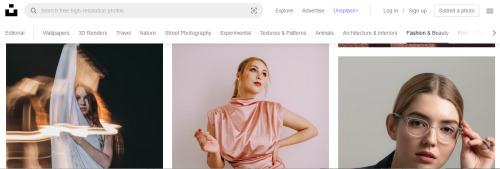</a>|
|**[Wikimedia Commons](https://commons.wikimedia.org/wiki/Main_Page)**|<a href="https://commons.wikimedia.org/wiki/Main_Page" target="_blank">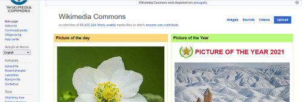</a>|
|**[Pexels](https://www.pexels.com/)**|<a href="https://www.pexels.com/" target="_blank">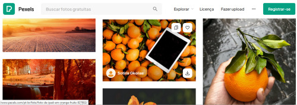</a>|
|**[Pixabay](https://pixabay.com/)**||
|**[PxHere](https://pxhere.com/)**|<a href="https://pxhere.com/" target="_blank">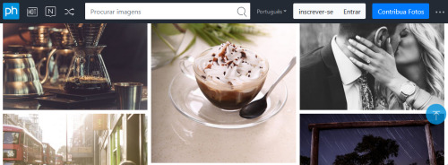</a>|
|**[StockSnap.io](https://stocksnap.io/)**||

## <a id="arte">Arte</a>

Os sites das seguintes instituições disponibilizam vários tipos de obras (pintura, fotografia, escultura, cerâmica, têxteis, etc.).

|Site||
|---|---|
|**[Rijksmuseum](https://www.rijksmuseum.nl/en)** Disponibiliza imagens de altíssima resolução do seu vasto acervo|<a href="https://www.rijksmuseum.nl/en" target="_blank">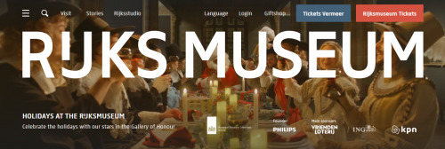</a>|
|**[Europeana](https://www.europeana.eu/pt)** Grande repositório digital do património cultural da Europa||
|**[The British Museum](https://www.britishmuseum.org/)**|<a href="https://www.britishmuseum.org/" target="_blank">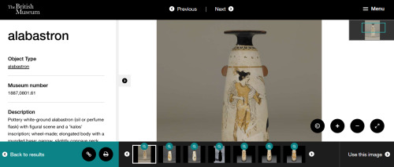|
|**[Louvre](https://www.louvre.fr/en)**||
|**[The New York Public Library Digital Collections](https://digitalcollections.nypl.org/)**|<a href="https://digitalcollections.nypl.org/" target="_blank">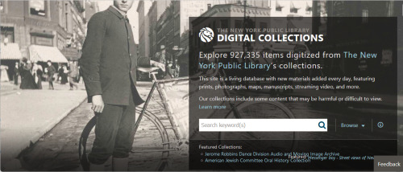</a>|
|**[Old Book Illustrations](https://www.oldbookillustrations.com/)** Ilustrações retiradas de livros antigos|<a href="https://www.oldbookillustrations.com/" target="_blank">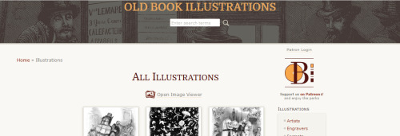</a>|
|**[Artvee](https://artvee.com/)** Agregador de imagens de diferentes instituições|<a href="https://artvee.com/" target="_blank">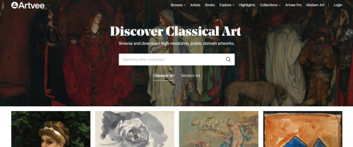</a>|
|**[Art UK](https://artuk.org/)** Agregador de obras de arte de diferentes instituições do Reino Unido|<a href="https://artuk.org/" target="_blank">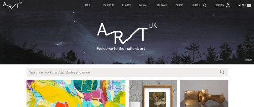</a>|

## <a id="vetoriais">Imagens/Ilustrações Vetoriais</a>

As imagens vetoriais caracterizam-se por serem compostas por formas geométricas, definidas matematicamente. Ao contrário das imagens fotográficas (também conhecidas como imagens raster), as imagens vetoriais podem ser manipuladas sem perda de qualidade e requerem aplicativos informáticos específicos (por exemplo: [Inkscape](https://inkscape.org/), [Adobe Illustrator](https://www.adobe.com/pt/products/illustrator.html), etc.).

Os seguintes sites disponibilizam um grande número de imagens vetoriais, impondo diferentes condições na sua utilização.

|Site||
|---|---|
|**[Open Clipart](https://openclipart.org/)**|<a href="https://openclipart.org/" target="_blank">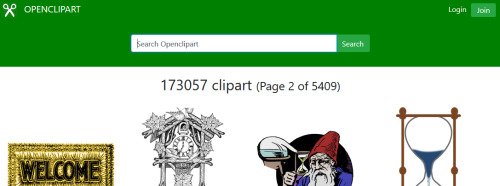</a>|
|**[Freepik](https://www.freepik.com/vectors)**||
|**[unDraw](https://undraw.co/illustrations)** Ilustrações vetoriais open source, de utilização livre e gratuita|<a href="https://undraw.co/illustrations" target="_blank">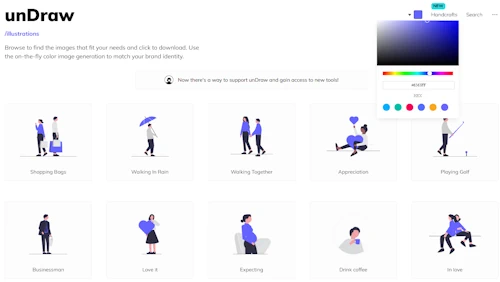</a>|

## <a id="video">Vídeo</a>

|Site||
|---|---|
|**[Pexels](https://www.pexels.com/videos/)**|<a href="https://www.pexels.com/videos/" target="_blank">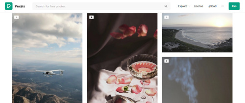</a>|

## <a id="musicasom">Música e Som</a>

|Site||
|---|---|
|**[BBC Sound Effects Archive](https://sound-effects.bbcrewind.co.uk/)** Clips de som de variados tipos|<a href="https://sound-effects.bbcrewind.co.uk/" target="_blank">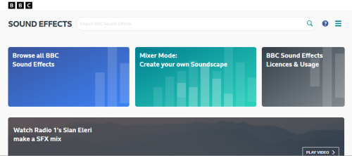</a>|
|**[Free Music Archive](https://freemusicarchive.org/)** Fornece acesso a música de artistas independentes||
|**[Freesound](https://freesound.org/)** Disponibiliza uma grande variedade de sons gratuitos e de utilização livre|<a href="https://freesound.org/" target="_blank">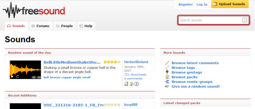</a>|

## <a id="livros">Livros</a>

|Site||
|---|---|
|**[Project Gutenberg](https://www.gutenberg.org/)** Biblioteca de livros em formato eletrónico e que estão no domínio público|<a href="https://www.gutenberg.org/" target="_blank">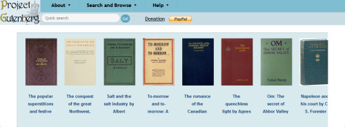</a>|

## <a id="outros">Outros</a>

|Site||
|---|---|
|**[Internet Archive](https://archive.org/)** Gigantesco repositório de websites, livros, revistas, áudio, vídeo, software, etc.|<a href="https://archive.org/" target="_blank">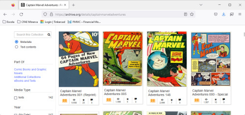</a>|
|**[OpenGameArt.org](https://opengameart.org/)** Repositório de recursos gratuitos e de utilização livre para criação de jogos (imagens, sons, música, tutoriais, etc.)|<a href="https://opengameart.org/" target="_blank">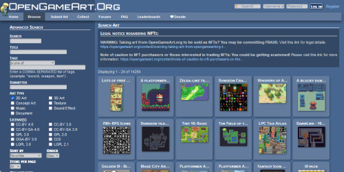</a>|